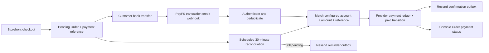

# PayFS bank-transfer payment brainstorm

## Summary

Nexus will accept customer bank transfers detected by PayFS, with **Resend** for payment-confirmation and 30-minute reminder email. A generated Nexus payment reference is the reconciliation key. PayFS is not assumed to provide a hosted checkout: its public quickstart describes bank-transaction webhooks.

The supplied merchant beneficiary details and PayFS credentials are intentionally omitted from this report. Webhook credentials were supplied in the PRD as plaintext; they must be rotated before testing and moved to the public Worker environment's secret store.

## Outcome

- A Storefront checkout creates a pending Order with a unique payment reference and renders the approved transfer instructions.
- A valid PayFS transaction confirms the matching Order, writes an auditable provider payment record, and enqueues one Resend payment-confirmation email.
- If no confirmation arrives after 30 minutes, reconciliation checks PayFS before exactly one reminder email is sent.
- Nexus Operations Console keeps its two existing destinations; payment status, provider events, and a manual **Check PayFS now** action live in an Order detail.

## Constraints

- Payments are VND bank transfers. A confirmed transaction must be `credit`, match the configured recipient bank/account, equal the Order total, and contain the Order's generated payment reference.
- Authenticate every PayFS webhook using `X-Client-API-Key`, HMAC-SHA256 signature, and a five-minute timestamp window. Deduplicate by PayFS `transaction_id`.
- Worker-only secrets: PayFS API token, webhook API key, webhook signing secret, and Resend API key. Storefront receives no secret, capability, or Console-only payment evidence.
- The public test endpoint is `https://nexus-console.cppsw.com/api/payfs/webhook`; the service currently originates from local port 5173.
- Domain writes, SQL batches, and transitions belong in `@nexus/orders`; Worker stays HTTP/platform composition. Storefront remains HTTP-only.
- Existing migrations are append-only. The current `payments` schema and TypeScript projection represent only `manual` payments, so provider payment support needs a clean migration and projection cutover.
- Resend needs a verified sender/domain before real delivery.

## Non-goals

- Hosted PayFS checkout, card payments, e-wallets, QR/VietQR generation, automated refunds, and a new Console navigation destination.
- Automatically marking an Order paid from an ambiguous, partial, wrong-currency, wrong-account, wrong-amount, or reference-less transaction.
- Persisting provider secrets in source control, logs, browser bundles, migration files, or this report.

## Acceptance criteria

1. Creating an Order produces a unique payment reference and displays the approved beneficiary instructions, VND total, and transfer reference on the private Order page.
2. One valid PayFS credit transaction causes one provider payment record, a `paid` transition, one system history entry, and one confirmation-email outbox item.
3. Retried webhook deliveries with the same `transaction_id` do not duplicate records, transitions, or emails.
4. Invalid key/signature/timestamp/payload, debit transactions, and unmatched credits leave the Order pending and create a sanitized audit outcome only.
5. The scheduled 30-minute path reconciles first; a discovered valid payment confirms the Order, otherwise one reminder is queued. Repeated schedules do not resend it.
6. Console Order detail displays payment state, latest sanitized provider/reconciliation outcome, and an authorized manual recheck control.
7. Storefront and Console preserve the existing privacy, token, mobile-width, and primary-action contracts.

## Options considered

| Option | Decision | Trade-off / first failure |
| --- | --- | --- |
| Bank transaction webhook plus scheduled reconciliation | Chosen | Works with documented PayFS transaction-credit webhooks; recovery depends on a reliable transaction-list API contract. |
| PayFS `order.success` / `order.failed` event flow | Rejected now | Public docs show the events but do not document the required PayFS order-creation/payment-link contract or external order-ID mapping. |
| Webhook-only confirmation | Rejected | Cannot satisfy the explicit recovery requirement when a webhook is missed. |

## Recommended design

1. Keep Order creation idempotent and reuse its existing payment-reference field as the payment instruction code.
2. Add a package-owned PayFS confirmation command that atomically stores the event outcome, prevents duplicate transaction processing, records the provider payment, changes the Order state, and enqueues mail.
3. Persist provider events, match outcomes, reconciliation attempts, and email-outbox state. Logs must redact credentials and should not expose raw provider evidence to customer projections.
4. Add a public Worker webhook route and an authenticated Console recheck route. Add a scheduled Worker handler for reconciliation and outbox delivery.
5. Put transfer instructions on the private Storefront Order page; put provider status and manual recheck in the existing Console Order detail.

## Evidence

- `packages/orders/src/commands/order-write.ts` creates a pending Order and generated `payment_reference`.
- `migrations/0007-manual-payments.sql` constrains `payments.source` to `manual`; `packages/orders/src/order-types.ts` mirrors that restriction.
- `apps/worker/src/index.ts` and `wrangler.jsonc` currently contain no PayFS webhook route or scheduled handler.
- The current Storefront Order page shows payment reference but not PayFS transfer instructions.
- Project rules constrain Console navigation to Products and Orders and keep Storefront HTTP-only.
- PayFS requires a public endpoint, 2xx response, API-key validation, transaction-ID deduplication, and recommends signed webhooks. Its signature expires after five minutes and uses sorted JSON with `timestamp + "." + payload`.

## References

- [PayFS quickstart](https://docs.payfs.vn/vi/developers/quickstart)
- [PayFS webhook contract](https://docs.payfs.vn/vi/developers/webhooks)
- [PayFS webhook signatures](https://docs.payfs.vn/vi/developers/webhook-signature)
- [PayFS API tokens](https://docs.payfs.vn/vi/developers/api-token)

## Unresolved questions

1. PayFS public docs identify `GET /v1.1/transactions` but do not specify pagination, time-range, or reference/content filtering. The provider must supply this contract before Nexus can prove that reconciliation cannot miss a valid transaction.
2. The Resend verified sender address/domain and its production delivery configuration remain deployment prerequisites.
3. If QR/VietQR is required rather than text transfer instructions, approve its provider, visual contract, and merchant-account configuration separately.
